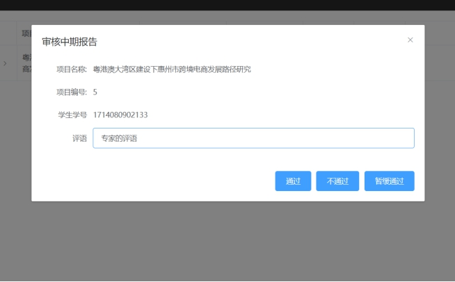
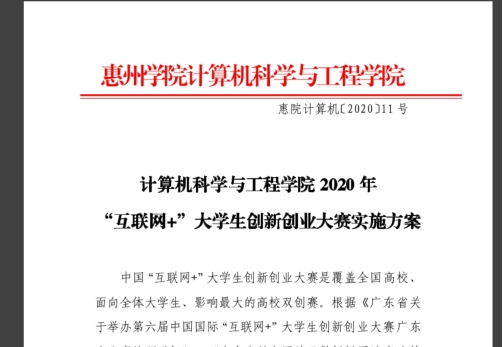

# 惠州学院大创中期报告管理系统

## 技术说明

1. 开发环境，使用运维容器docker，其中使用docker部署环境的如下：

语言环境：Java jdk(版本>1.8)

数 据 库：MySQL(版本大于5.7)、Redis(版本大于3.0)

文件系统：Fastdfs轻量级分布式文件系统5.x

文件在线预览：kkfileview2.x

其他环境：

Tomcat：>8.0版本，springboot自带

 

2. 开发框架和语言

后端：SpringBoot2.2.2、Spring security oauth2、hutool

前端：HTML、CSS、JavaScript、vue.js>2.x、node.js>10.x

## 模块说明

1. dependenices模块中，没有包结构，只有pom依赖管理。

2. commons子模块中，只有com.wzq.da.chuang.commons.utils包，其中存放通用工具类。

3. model公共bean子模块中：

com.wzq.da.chuang.model.pojos包存放系统用到的实体类。

com.wzq.da.chuang.model.mappers包存放dao层对象关系映射接口。

com.wzq.da.chuang.model.dto包存放前后端数据传输对象。

4. security用户登录认证微服务：

com.wzq.da.chuang.security.config包存放该微服务的配置类

com.wzq.da.chuang.security.controller包存放该微服务的controller接口

com.wzq.da.chuang.security.service.包存放该微服务的业务逻辑接口

com.wzq.da.chuang.security.service.impl包存放该微服务的业务逻辑接口实现类

5. file文件管理微服务：

com.wzq.da.chuang.file.config包存放该微服务的配置类

com.wzq.da.chuang.file.controller包存放该微服务的controller接口

com.wzq.da.chuang.file.service包存放该微服务的业务逻辑接口

com.wzq.da.chuang.file.service.impl包存放该微服务的业务逻辑接口实现类

6. report主要业务逻辑微服务：

com.wzq.da.chuang.report.config包存放该微服务的配置类

com.wzq.da.chuang.report.controller包存放该微服务的controller接口

com.wzq.da.chuang.report.service包存放该微服务的业务逻辑接口

com.wzq.da.chuang.report.service.impl包存放该微服务的业务逻辑接口实现类

## 页面展示

### **1.** 系统运行环境说明

1.1 运行环境：

网络：移动设备有网络可用2G、3G、4G、WIFI都可以。

操作系统：windows系统

1.2 软件的使用步骤

系统运行：

输入该系统的网址进入登陆页面（如图1所示），然后根据账号分别跳转到不同身份（学生、指导老师、二级学院管理者、大创管理者、评审专家）所对应的主页中：

 

图1 系统登陆界面

### **2.** 各个模块功能介绍

#### 2.1学生模块

2.1.1学生模块使用说明

该功能为学生用户登陆账号跳转到学生首页对系统中的学生模块功能进行使用，学生模块的主要功能有新建中期报告，上传中期报告文件，预览文件，删除文件，查看项目详情：

1. 学生用户进入该系统后如下界面

 

图2 学生端主页界面

 

2.1.2新建中期报告功能

该功能为用户提供新建中期报告的服务，具体使用步骤如下：

1. 点击图2中的按钮，跳转到新建中期报告的页面，可以填写简介后新建一个中期报告文件：

 

图3 学生主页新建中期报告页面

 

 

图4 中期报告新建成功界面

 

2.1.3上传中期报告文件功能

该功能为学生上传中期报告文件功能相关页面的服务，具体使用步骤如下：

  1.用户在新建完中期项目后点击图2中的按钮进入中期报告详情界面（图5）：

 

图5 中期报告详情界面

 

2. 点击图5中的图标，在本地文件列表中选择要上传的文件（图6），选择完成后点击按钮对选中的文件进行上传，上传成功后将文件显示在下面的文件列表框中（图7）：

 

图6 选取文件后界面

 

 

图7 上传成功后显示界面

2.1.4预览中期报告功能

该功能为用户提供中期报告预览服务，具体使用步骤如下：

1. 用户点击图7中的按钮，进入预览页面（图8），效果如下所示：

 

图8 文件预览页面

 

2.1.5下载中期报告功能

1.项目的负责人可上传文件，上传后可对上传的文件进行下载，下载成功后为下图（图9）所示： 

 

图9下载文件并查看文件内容

##  

2.1.6中期报告文件删除功能

该功能为用户提供删除所上传中期报告文件的服务，具体使用步骤如下：

1. 用户点击图7中的 按钮，对文件进行删除操作，点击后出现是否删除的提示（图9），点击确定进入删除成功界面（图10）

 

图10 删除确认界面

 

 

图11 删除成功界面

 

2.1.7 查看项目详情功能

该功能为用户提供查看该项目详情功能的服务具体使用步骤如下：

1. 用户点击图2中的按钮查看项目详情（图12）

 

图12 查看项目详情页面

 

#### 2.2指导老师模块

2.2.1指导老师功能使用说明

指导老师主界面中提供认可中期报告、查看中期报告详情以及预览中期报告文件、下载中期报告文件的功能，具体使用步骤如下：

1. 使用指导老师账号在登录页面进行登录之后，进入如下指导老师主页界面：

 

图13 指导老师主界面

 

2.2.2查看中期报告功能

1.用户点击图12中的按钮，会跳出对应的中期报告详情内容，效果如下：

 

图14 查看中期报告详情

 

2.2.3预览中期报告功能

1.若该项目的负责人有上传文件，则可对上传的文件进行预览和下载，预览成功后为下图（图15）所示： 

 

图15 预览功能页面

 

2.2.4下载中期报告详情功能

1.若该项目的负责人有上传文件，则可对上传的文件进行下载，下载成功文件打开后为下图（图16）所示：

|      |                         |
| ---- | ----------------------- |
|      |  |

图16 下载文件并查看文件内容

 

2.2.5查看项目详情功能

该功能为用户提供查看该项目详情功能的服务具体使用步骤如下：

1.用户点击按钮查看项目详情（图17）

 

图17 点击扩展按钮查看中期报告详情

 

2.2.6审核中期报告功能

1.在该界面中点击审核按钮，可对该中期报告进行审核认可，其中可输入评语，之后点击通过/不通过/退回修改按钮即可提交认可，如下图（图18，19）所示：

 

图18 指导老师中期报告认可页面

 

图19 对应的中期报告详情会显示导师的评语

 

#### **2.3** **评审专家模块**

2.3.1评审专家功能使用说明

评审专家主界面中提供认可中期报告、查看中期报告详情以及预览下载中期报告文件的功能，具体使用步骤如下：

1. 使用评审专家账号在登录页面进行登录之后，进入如下界面：

 

图20 评审专家主界面

 

2.3.2查看中期报告详情功能

1.在该界面中可以点击查看按钮，会跳出对应的中期报告详情内容，效果如下：

 

图21查看中期报告详情页面

 

2.3.3预览中期报告功能

1.若该项目的负责人有上传文件，则可对上传的文件进行预览和下载，预览成功后为下图（图22）所示：

 

图22 预览功能页面

 

2.3.4下载中期报告功能

1.若该项目的负责人有上传文件，则可对上传的文件进行下载，下载成功后为下图（图23）所示：

 

图23 下载文件并查看文件内容

2.3.5查看项目详情功能

该功能为用户提供查看该项目详情功能的服务具体使用步骤如下：

1.用户点击按钮查看项目详情（图24）

 

图24 查看项目详情页面

 

2.3.6审核中期报告功能

1.在该界面中点击审核按钮，可对该中期报告进行审核认可，其中可输入评语，之后点击通过/不通过/暂缓通过按钮即可提交认可，如下图所示（图25，26）：

 

图25 评审专家中期报告认可页面

 

图26 中期报告评审专家评语页面

 

#### **2.4** **二级学院管理员模块**

2.4.1功能使用说明

二级学院管理员主界面中提供认可中期报告、查看中期报告详情、预览中期报告文件、下载中期报告文件以及查询中期报告功能，具体使用步骤如下：

1. 使用二级学院管理员账号在登录页面进行登录之后，进入如下界面：

 

图27 二级学院管理员主界面

 

2.4.2查看中期报告详情功能

1.在该界面中可以点击查看按钮，会跳出对应的中期报告详情内容，效果如下图所示（图28）：

 

图28 查看中期报告详情

2.4.3预览中期报告文件功能

1.若该项目的负责人有上传文件，则可对上传的文件进行预览和下载，预览功能效果如下（图29）。

 

图29 预览功能界面

 

2.4.4下载中期报告文件功能

1.若该项目的负责人有上传文件，则可对上传的文件进行下载，下载后打开效果如下（图30）：

 

图30 下载文件并查看文件内容

 

2.4.5查看项目详情功能

该功能为用户提供查看该项目详情功能的服务具体使用步骤如下：

1.用户点击按钮查看项目详情（图31）：

 

图31 点击扩展按钮查看中期报告详情

 

2.4.6审核中期报告功能

1.在该界面中点击审核按钮，可对该中期报告进行审核认可，其中可输入评语，之后点击通过/不通过/退回学生/退回导师按钮即可提交认可，效果如下图（图32）所示：

 

图32二级学院管理员中期报告认可页面

 

图33 中期报告二级学院管理员评语显示页面

 

2.4.6 查找中期报告功能

1.在该页面顶部有查找按钮，点击之后会弹出表单（图34），在对应的输入框中输入想查找的内容即可对所有已提交中期报告进行查找（支持模糊搜索），其中没有输入的内容则查找所有已提交的中期报告，效果如下图（图35）所示：

 

图34 查找界面

 

 

图35 查找结果页面

 

#### 2.5大创管理员模块

2.5.1 功能使用说明

大创管理员主界面中提供认可中期报告、查看中期报告详情、预览中期报告文件、下载中期报告文件、查询中期报告以及指派专家（包括单一指派和批量指派）功能，具体使用步骤如下：

1. 使用大创管理员账号在登录页面进行登录之后，进入如下界面：

 

图36 大创管理员主界面

 

2.5.2 查看中期报告详情功能

1.在该界面中可以点击查看按钮，会跳出对应的中期报告详情内容，效果如下：

 

图37 查看中期报告详情

 

2.5.3 预览中期报告功能

1.若该项目的负责人有上传文件，可对上传的文件进行预览和下载，效果如下（图38）所示：

 

图38 文件预览效果

 

2.5.4 下载中期报告功能

1.若该项目的负责人有上传文件，可对上传的文件进行下载，效果如下（图39）所示：

 

图39 下载文件并查看文件内容

 

2.5.5 查看项目详情功能

该功能为用户提供查看该项目详情功能的服务具体使用步骤如下：

1.用户点击按钮查看项目详情（图40）：

 

图40 查看中期报告详情

 

2.5.6 中期报告审核功能

1.在该界面中点击审核按钮，可对该中期报告进行审核认可，其中可输入评语，之后点击通过/退回按钮即可提交认可（图41），认可后可在中期报告详情中查看评语（图42），效果如下图所示：

 

图41 大创管理员中期报告认可界面

 

图42 中期报告大创管理员的评语显示页面

 

2.5.7 中期报告查找功能

1.在该页面顶部有查找按钮，点击之后会弹出表单（图43），在对应的输入框中输入想查找的内容即可对所有已提交中期报告进行查找（支持模糊搜索），其中没有输入的内容则查找所有已提交的中期报告（图44），效果如下所示：

 

图43 查找页面

 

 

图44 查找结果页面

 

2.5.8 专家指派功能

1.在该页面中有指派专家按钮（单一指派）和批量指派按钮，点击按钮即可弹出对应的弹窗，效果如下图（图45，46）所示：

 

图45 选择指派的专家页面（单一指派）

 

图46 批量指派专家页面

 

2.5.9 汇总报表功能

1.在该页面中点击按钮即可汇总导出所有中期报告，并查看中期报告内容，效果如下图所示：

 

图47 点击汇总报表按钮

 

图48查看报表内容

 